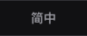
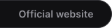
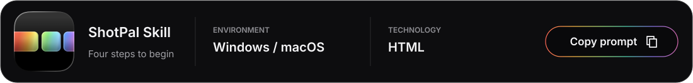
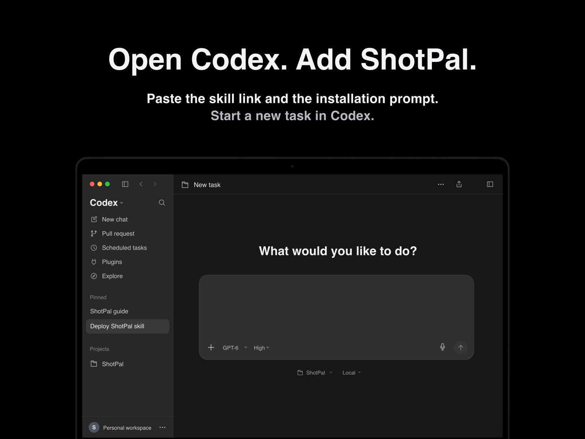
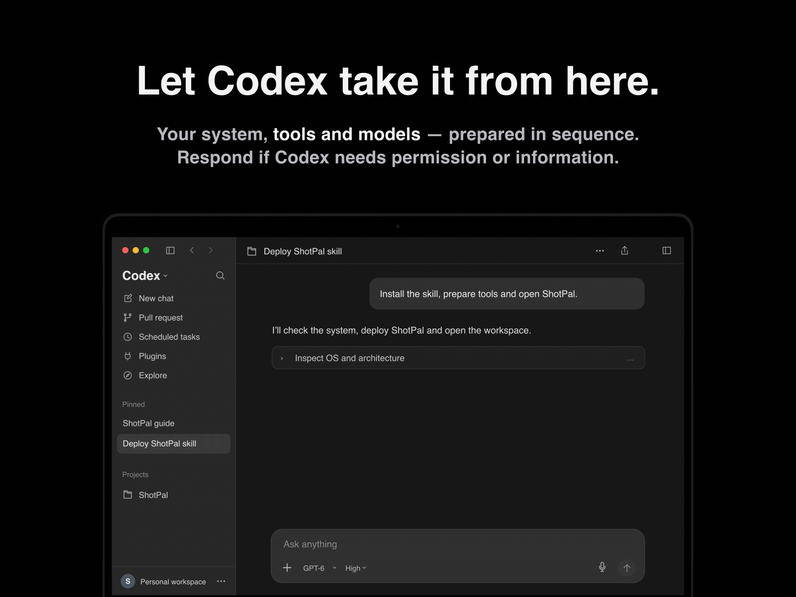
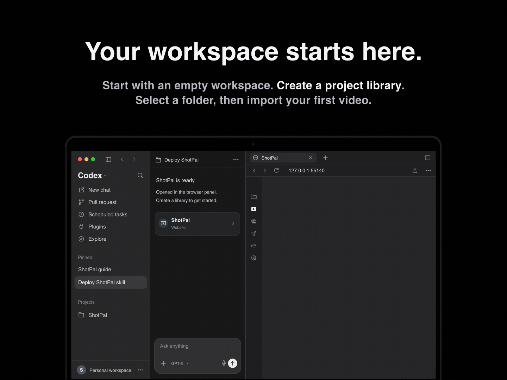
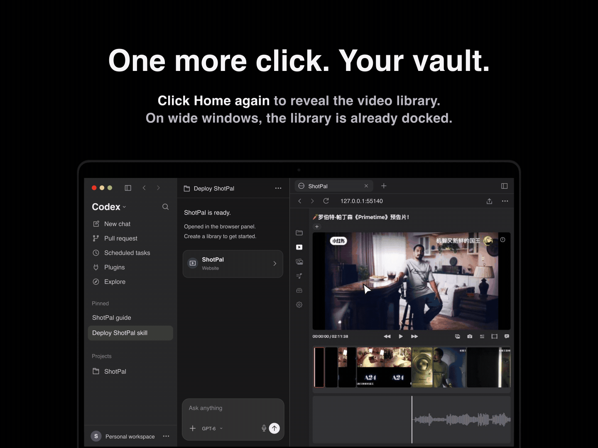

<p align="center"><a href="README.md" title="English"></a><a href="README.zh-CN.md" title="简体中文"></a><a href="https://shotpal.newtybei.com" title="Official website"></a></p>

<p align="center"></p>

<p align="center"><a href="#start"></a></p>

<a name="start"></a>

### 1. Open Codex and install ShotPal

<p align="center"></p>

<details>
<summary>Installation prompt — copy into Codex</summary>

```text
Install the skill at the root of this repository as shotpal:
https://github.com/Newtype-linbei/shotpal-portable

Then follow its SKILL.md to deploy ShotPal: detect my system, install
missing video-download, scene-detection, transcription and music-recognition
tools and models, verify the setup, and open ShotPal. Generate a short local
test video with known cuts in a separate test library, run actual shot
recognition, and check its boundaries, thumbnails, playback, saved outputs
and persistence after reopening. Fix failures and recheck before handoff.
Report what passed and any remaining blockers or unverified features.
Preserve my existing libraries, projects and files.
```

</details>

### 2. Prepare tools and models

<p align="center"></p>

### 3. Choose your project library

<p align="center"></p>

### 4. Click Home to open your video library

<p align="center"></p>

## What is ShotPal Skill?

ShotPal Skill brings shot-by-shot film analysis into Codex. It opens an HTML workspace in Codex’s browser, where you can study scenes, frames, subtitles and music, then organize them into a reusable reference library.

## Why use ShotPal Skill?

- **For people without a Mac.** The HTML workspace and Windows x64 setup workflow offer a way to study films without the native Mac app.
- **Adapt it to your own workflow.** Ask Codex to adjust the interface, interactions and exports to suit the way you analyze and organize references.
- **Upgrade as your needs grow.** Customize the skill instructions, change compatible tools or models, and add features for your own projects. You can keep those changes in a personal fork or contribute them back.

## How to get started

Copy the installation prompt into Codex. It prepares the tools and models, then **creates a short test video itself** in a separate test library. Codex runs basic shot recognition and compares the results with the video's known cuts, checks thumbnails and playback, and reopens the library to confirm the results were saved. It fixes failures and checks again before reporting the outcome. You do not need to supply footage for this basic check.

After verification, create or choose your own library, import your first video, and click Home to open the video library and start analyzing. The generated clip checks basic local recognition; source-site downloads, speech accuracy and positive music matches require their own tests.
