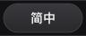
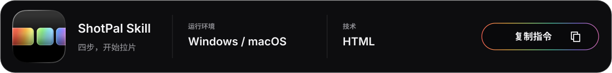
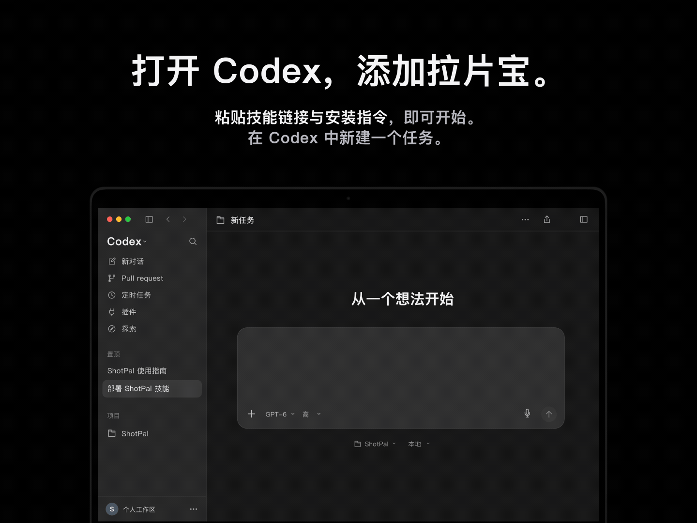
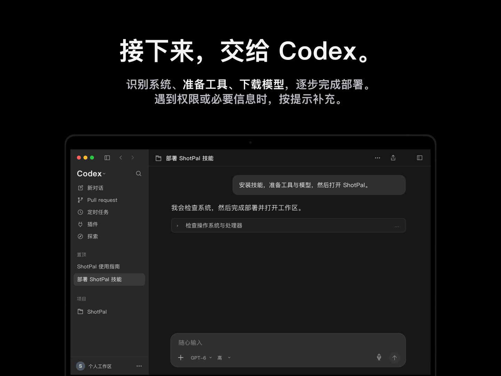
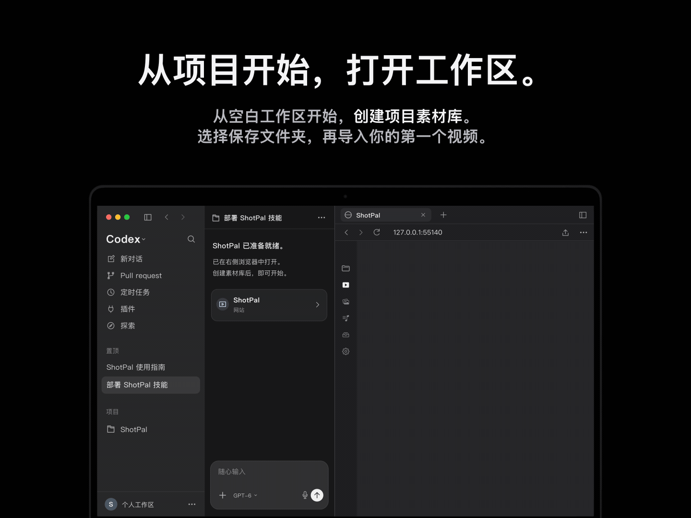
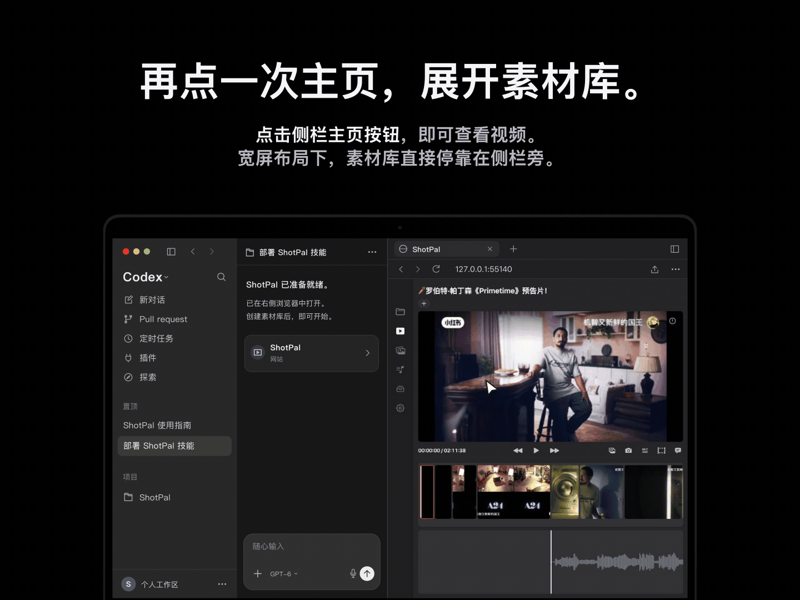

<p align="center"><a href="README.md" title="English"></a><a href="README.zh-CN.md" title="简体中文"></a><a href="https://shotpal.newtybei.com" title="访问官网"></a></p>

<p align="center"></p>

<p align="center"><a href="#start"></a></p>

<a name="start"></a>

<p align="center"></p>

<details>
<summary>安装指令 — 复制到 Codex</summary>

```text
从以下仓库根目录安装 ShotPal 技能，命名为 shotpal：
https://github.com/Newtype-linbei/shotpal-portable

然后按照它的 SKILL.md 完成部署：检测我的系统，安装缺少的视频下载、
分镜识别、字幕转写和音乐识别工具与模型，验证环境，并打开 ShotPal。
自行生成一段切点已知的本地测试视频，放入独立测试素材库，运行真实
分镜识别，核对切点、缩略图、播放、保存的输出及重新打开后的恢复情况。
交付前修复问题并复查，说明通过项、仍受阻或未验证的功能。
保留已有素材库、项目与文件。
```

</details>

<p align="center"></p>

<p align="center"></p>

<p align="center"></p>

## 什么是 ShotPal Skill？

ShotPal Skill 让你在 Codex 中开始拉片。它会在 Codex 的浏览器中打开 HTML 工作区，帮助你研究镜头、画面、字幕与音乐，并将有用的素材整理成可复用的参考库。

## 为什么使用 ShotPal Skill？

- **没有 Mac，也能探索拉片。** HTML 工作区与 Windows x64 部署方案，为没有 Mac 的用户提供另一种方式，无需安装原生 Mac 应用。
- **按自己的习惯调整。** 让 Codex 根据你的拉片方式，修改界面、交互和导出流程，适应个人的素材整理需求。
- **随需求持续升级。** 自定义技能指令，更换兼容的工具或模型，为自己的项目增加功能。你可以在个人分支中保留这些调整，也可以将改进贡献回来。

## 如何开始

将安装指令复制到 Codex。它会准备工具与模型，然后在独立测试素材库中**自行生成一段测试视频**，运行基础分镜识别，对照已知切点核查结果，检查缩略图与播放，并重新打开素材库确认结果已保存。发现问题后修复并复查，再报告检查结果。基础检查不需要你提供素材。

验证后，创建或选择自己的素材库，导入第一个视频，再点击主页打开视频素材库，开始拉片。生成的片段用于检查基础本地识别；平台下载、语音转写准确性和真实音乐匹配仍需分别验证。
